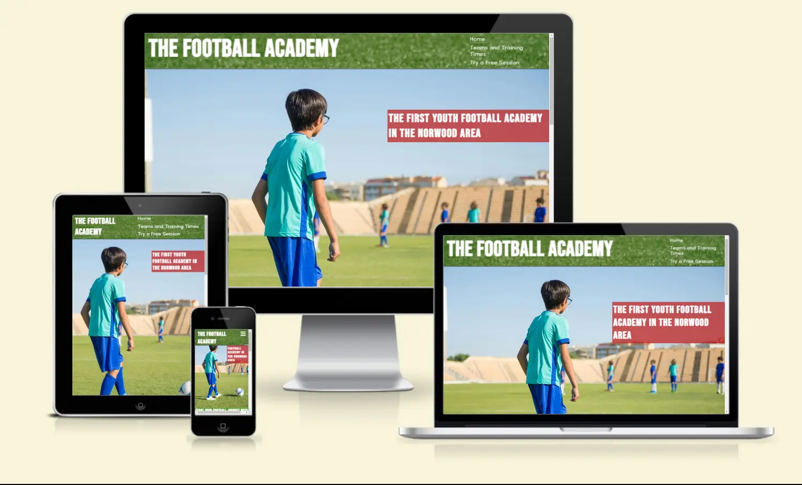
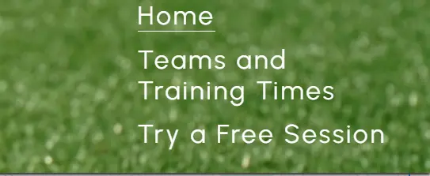
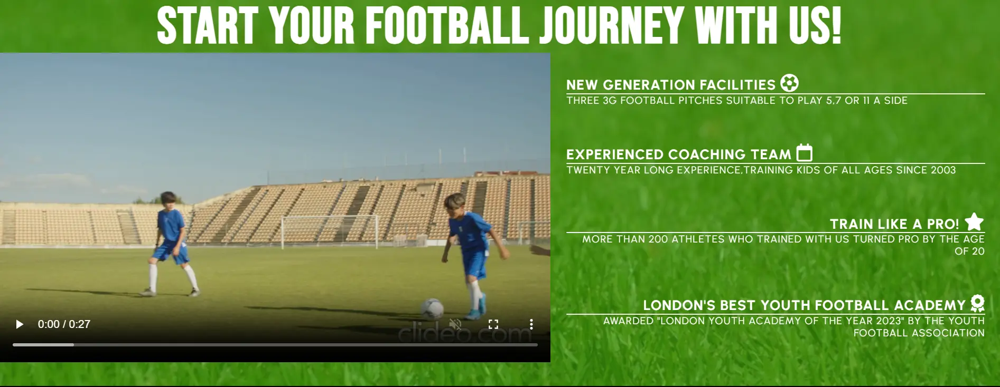
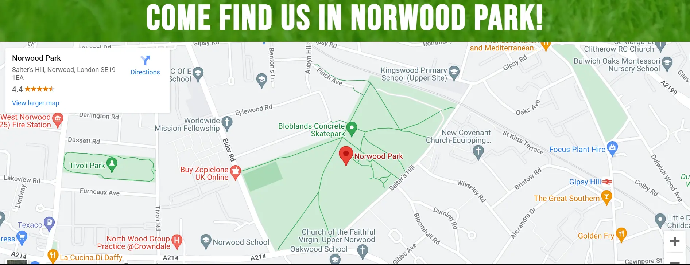
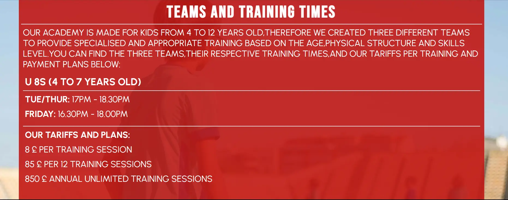
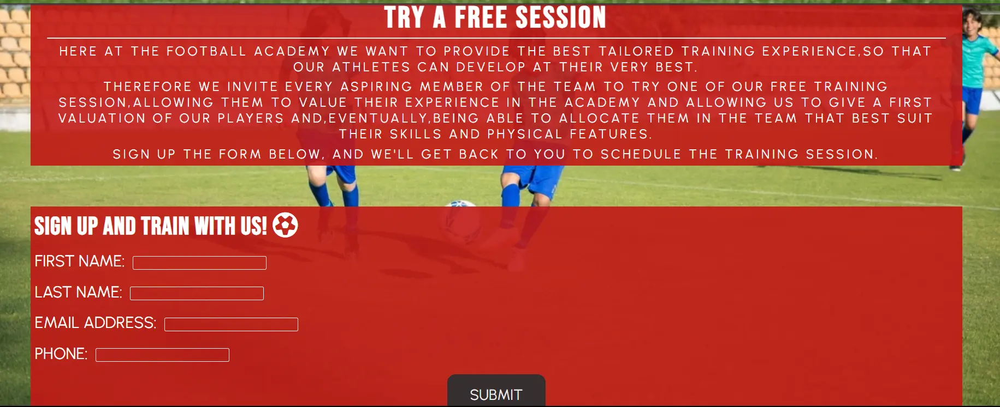
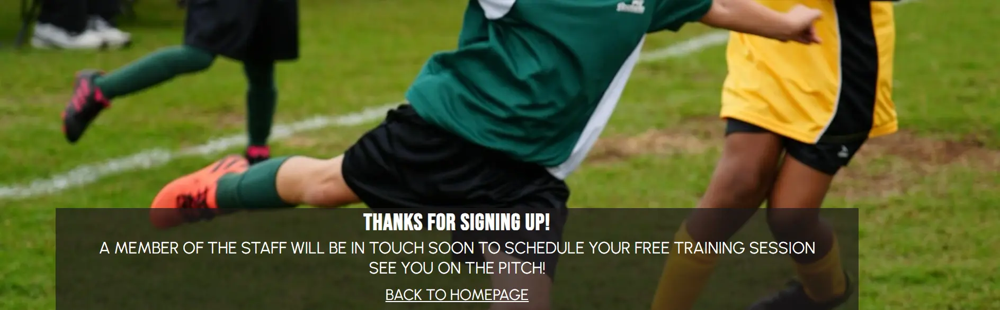
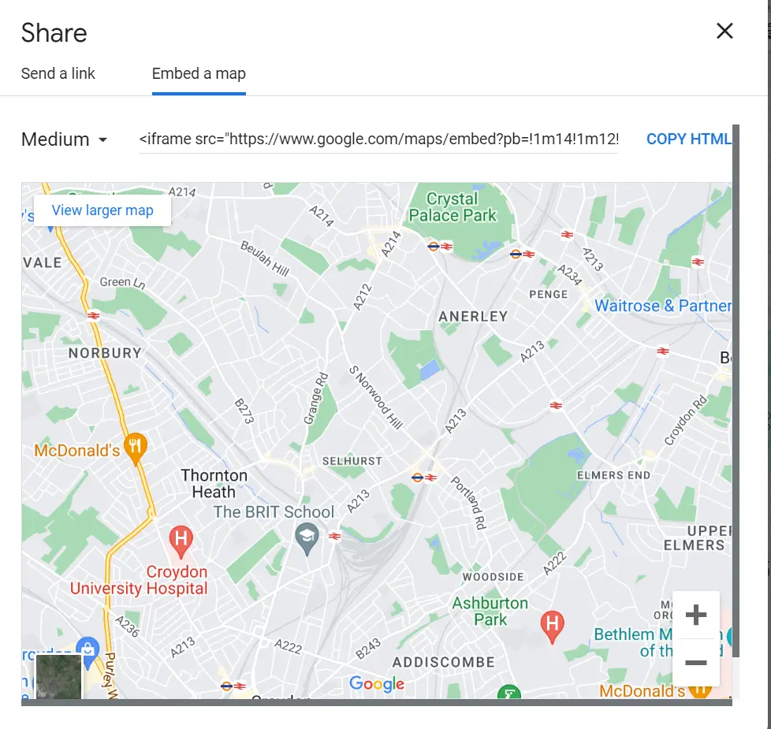
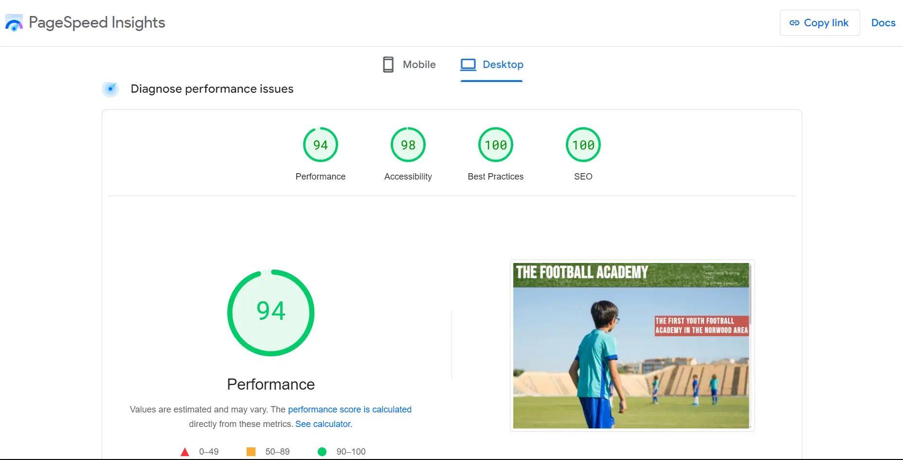

                                        THE FOOTBALL ACADEMY

The Football Academy website page is made for
a youth football academy for kids from the age 
of 7 to the age of 13.
Users on this website will find useful informations
about the club and why is one of the best youth
football academy in London, all supported by a 
video, a page with the differents teams and the
respective training times and a signup form that
gives the opportunity to book a free training 
session to anyone interested on joining.
The website is targeted towards parents looking
for a football club to join for their kids.

 FEATURES

-Navigation:

    The website features a navigation menu,with direct link to the other pages of the website.
    The navigation menu,on the top right side of the page,is hidden and can be toggled with an icon (all icons are from  the "fontawesome" website) on mobiles and small screen devices,while it shows in columns for tablets and devices with larger screens.
    All the navbar elements are shown in white color (hex:#fafafa) and the menu elements font is:"Urbanist"(all fonts are from "Google Fonts");

    
  

-The Header:

     The Header is the logo of the football academy and is shown on the top left part of the page.
     The logo is shown in "Bebas Neue" uppercase font,and in white color (hex:#fafafa); 

-Hero image Section:

    The Hero image Section is comprehensive of the hero image(all images and videos are from the pexels website) that shows a kid in a football pitch,with on the side a cover text with an introduction of the football academy,which is the first youth football academy in the London's Norwood area;  
 

-Reasons Section:

    The Reasons section features two elements:a short video of kids playing football,that doesn't play automatically,has not volume,and has controls,so that the user can play it,pause it,play it on full screen and eventually share it or download it;
    the other element of the reasons section,is a brief explanation of why the football academy might be the right choice for the user,explaining the quality of the faciities, of the coaching staff,the quantity of players who turned pro after being part of it,and pointing out achievements like the award for the "London's Best Youth Football Academy";

   

-Free Training Session Link:

    The Free Training Session Link, is a link that takes the user directly to the training page,which is a page where a free training session can be booked by signing up a form.
    The Free Training Session Link,is located underneath the Reasons Section,so that if the user is caught from the content of the homepage,is given the chance to make a first and important contact with the academy in an easy and intuitive way.
    The Free Training Session Link,is featured also in the training page underneath the section regarding the teams and the training times.

-Map Section:

    The Map Section,features an iframe from Google Maps,showing the exact location of the football academy.
    The map is interactive and the user can open it on full screen and navigate it;

-Footer:

    The Footer,comprehends two sections inside of it: a section with the social networks icons,that are linked to the Facebook,X,Instagram and Youtube websites,and a contacts section,with two icons and next to them the phone number and the email address of the academy.
    For the Footer the same background image of the Header and Navbar was used;

-Training Page:

    The Training Page,is for the user to see the three different teams of the academy,their respective training times and the tariffs and payment pland for each of them.
    Same as for the homepage, a Free Training Session Link was located at the bottom of the page,to give the user an easy and intuitive way to go to the trial page if interested;

-Trial Page:

    The Trial Page,is for the user to signup a form that is needed to book a free training session.
    The page contains an intoduction explaining why the football academy requires to book a free trial session and the form itself on the lower half of the page.
    All the form fields are required and need to be filled to submit the form,the email field needs a "@" to be submitted,and once the form is filled and submitted correctly,the user will be redirected to the Formdump Page;

-Formdump Page:
 
    The Formdump Page, has the goal to show the user that the free training session form was submitted correctly and that a member of the staff of the academy will be in touch soon to schedule the training session.
    The page features a homepage link that takes the user back to the homepage;

TESTING

     I tested that the website works on Google Chrome,Mozilla Firefox and Microsoft Edge;

     I confirm that this project is responsive,looks good and function on all screen sizes using the devtools device toolbar;

     I confirm that the navigation,header,reasons,free training link,footer,teams an training times,trial signup form and formdump page content are all readable and easy to understand;

     I have confirm that the form works,requires entries in every field,will only accept an email in the email field,and the submit button works.

BUGS

    -Had to fix the formdump link to the form submit button as i was using an absolute path,and it 
     wasn't working on my deployed page;
     This is how the code looked before i fixed it:

      <form id="signup-form" action="/formdump.html">

      After i removed the / from formdump.html,the link worked correctly;

    -Had to add a code to  embed the iframe map as it wasn't working on the deployed page;
     This is how i got the code:

    I have no  unfixed bugs to report.

VALIDATOR TESTING

    -HTML
        No errors reported after testing through the W3C validator;

    -CSS 
        No errors reported after testing through the Jigsaw validator;

    -Accessibility
        I confirm that the colors and fonts chosen are easy to read and accessible by running it through Lightouse in devtools:

      

DEPLOYMENT

    The site was deployed to GitHub pages.The steps to deploy are as follows:
    I selected the main branch as the source,in the GitHub repository Settings tab,once i did that,i was provided with the link to the live website page,now available in the repository:
https://github.com/alelodato/The-Football-Academy

CREDITS
    
    All the icons used for the toggle menu,the reasons section and the footer,were taken from the "Font Awesome" website;

    The font used in the website,"Bebas Neue" and "Urbanist",were taken from Google Font;

    All the background images and the reasons section video,were taken from the "Pexels" website.

   

    

    
