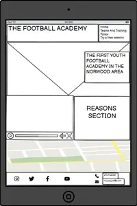
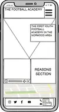
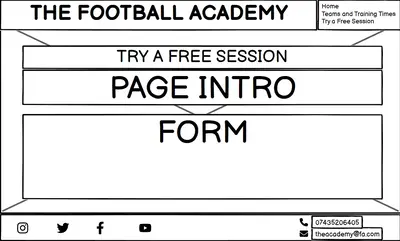
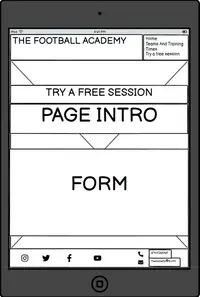
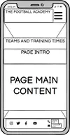
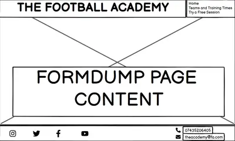
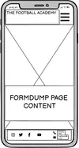

# THE FOOTBALL ACADEMY

    

Visit the deployed site: https://alelodato.github.io/The-Football-Academy/

The Football Academy website page is made for
a youth football academy for kids from the age 
of 7 to the age of 13.
Users on this website will find useful informations
about the club and why is one of the best youth
football academy in London, all supported by a 
video, a page with the differents teams and the
respective training times and a signup form that
gives the opportunity to book a free training 
session to anyone interested on joining.
The website is targeted towards parents looking
for a football club to join for their kids.

## DESIGN

### COLOUR SCHEME:

As the website is made for a football academy,i wanted to keep green and white as the main colours of it,recalling the coulours of a football pitch.
Where possible then, i used a white text on a green background, and where more contrast was needed i used a cover text as background for my content.
All the cover texts are transparent so that the background images are still visible.

* For all the text content and icons,i have used the colour #fafafa;
    
* For the Hero Image cover text i have used the colour rgba (193, 24, 21, 0.7);

* For the Reason section cover text i have used the colour rgba (52, 139, 12, 0.616);

* The Free Training Session Link colour when hovered is #ad0d0d;

* For the training and trial pages cover texts i have used the colour rgba (193, 24, 21, 0.9),which is the same as the Hero image cover text,but with less transparency to improve the contrast;

* For the form submit button of the trial page,i have used the colour #352f2f for the background and #fafafa for the text inside of it.
The text and background colours swap when the button is hovered;

* For the Formdump page cover text i have used the color rgba(30, 25, 25, 0.7);

* The Homepage Link colour when hovered is #086024;

### TYPOGRAPHY

All the fonts are imported from Google Fonts.
The Fonts imported are "Bebas Neue" and "Urbanist".

* The font "Bebas Neue" is a font that i think looks great for headlines,therefore i used it for the logo of the academy and all the page and section titles,sans-serif,in uppercase and with letter-spacing;

* The font "Urbanist" is the font i used for the pages paragraphs,which are in uppercase,as tried to keep the content as minimal as possible,but due the importance of the informations they contain,i wanted to give them a better visual impact;  
The navbar menu instead is in lowercase, as it shaped nice and has lovely clean lines.

### IMAGERY AND VIDEOS

As the website is for a football academy i wanted to use images of kids playing football,so to show the user that playing football is a fun and healthy activity to do for their kids,and eventually if a kid sees the website, i wanted them to imagine about being on pitch and playing, encouraging them to join the academy.
As mentioned on the colour scheme section,i have also used background images of a football pitch itself for the header,for the navbar menu,for the reasons section and for the footer.
For this purpose, i have used 5 different background images and video, all from the Pexels website.

### WIREFRAMES
 
Wireframes were created for mobile,tablet and desktop using Balsamiq.

 

## FEATURES

### NAVIGATION:

The website features a navigation menu,with direct link to the other pages of the website.
The navigation menu,on the top right side of the page,is hidden and can be toggled with an icon (all icons  are from  the "fontawesome" website) on mobiles and small screen devices,while it shows in columns for tablets and devices with larger screens.  
All the navbar elements are shown in white color (hex:#fafafa) and the menu elements font is:"Urbanist";

A background image from the Pexels website was used for the header and the toggle navigation menu:

### THE HEADER:

The Header is the logo of the football academy and is shown on the top left part of the page.
The logo is shown in "Bebas Neue" uppercase font,and in white color (hex:#fafafa); 

### HERO IMAGE SECTION:

The Hero image Section is comprehensive of the hero image,showing a kid in a football pitch,with on the side a cover text with an introduction of the football academy,which is the first youth football academy in the London's Norwood area;  

The color of the cover text is rgba(193, 24, 21, 0.7):

### REASONS SECTION:
The Reasons section features two elements:

* A short video of kids playing football,that doesn't play automatically,has not volume,and 
has controls,so that the user can play it,pause it,play it on full screen and eventually share it or download it;
      
* A brief explanation of why the football academy might be the right choice for the user,
explaining the quality of the faciities, of the coaching staff,the quantity of players who turned pro after being part of it,and pointing out achievements like the award for the "London's Best Youth Football Academy";

Another background image was used for this section,covered by a cover text,to improve contrast and accessibility.

The color of the cover text is rgba(52, 139, 12, 0.616):

### FREE TRAINING SESSION:

The Free Training Session Link, is a link that takes the user directly to the training page,which is a page where a free training session can be booked by signing up a form.
The link,is located under the Reasons Section,so that if the user is caught from the content of the homepage,is given the chance to make a first and important contact with the academy in an easy,quick and intuitive way.
The Free Training Session Link,is featured also in the training page under the section regarding the teams and the training times.

### MAP SECTION:

The Map Section,features an iframe from Google Maps,showing the exact location of the football academy.
The map is interactive and the user can open it on full screen and navigate it;

### FOOTER:

The Footer,comprehends two sections inside it: 
* A section with the social networks icons,that are linked to the Facebook,X,Instagram and 
 Youtube websites;
* A contacts section,with two icons and next to them the phone number and the email address 
of the academy,displayed in columns.

For the Footer was used the same background image of the Header and Navbar:

### TRAINING PAGE:

The Training Page,is for the user to see the three different teams of the academy,their respective training times and the tariffs and payment plans for each of them.
Same as for the homepage, a Free Training Session Link was located at the bottom of the page,to give the user an easy and intuitive way to go to the trial page if interested;

For this page was used the same hero image as the homepage,with a cover text for the content to improve the contrast and accessibility.
The color of the cover text is rgba(193, 24, 21, 0.9):

### TRIAL PAGE:

The Trial Page,is for the user to signup a form that is needed to book a free training session.
The page contains an intoduction explaining why the football academy requires to book a free trial session,and the form itself on the lower half of the page.
All the form fields are required and need to be filled to submit the form,the email field needs a "@" and an email format text to be submitted,and once the form is filled and submitted correctly,the user will be redirected to the Formdump Page;

For the trial page a different background image was used,with cover text as a background for the content to improve contrast and accessibility.
The cover text color is rgba(193, 24, 21, 0.9),same as the one for the training page:

### FORMDUMP PAGE:
 
The Formdump Page, has the goal to show the user that the free training session form was submitted correctly and that a member of the staff of the academy will be in touch soon to schedule the training session.
The page features a homepage link that takes the user back to the homepage;

This page has another background image,and the content has a cover text as a background to improve contrast and accessibility.
The color of the cover text is rgba(30, 25, 25, 0.7):

## TECHNOLOGIES USED

* [Balsamiq](https://balsamiq.com/) - Used to create wireframes.

* [Github](https://github.com/) - To save and store the files for the website.

* [GitPod](https://gitpod.io/) - IDE used to create the site.

* [Google Fonts](https://fonts.google.com/) - To import the fonts used on the website.

* [Google Developer Tools](https://developers.google.com/web/tools) - To troubleshoot and test features, solve issues with responsiveness and styling.

* [Pexels](https://www.pexels.com/) - To get all the images and videos needed for the website.

* [Image Resizer](https://imageresizer.com/) To compress,resize,and convert images to webp format.

* [Font Awesome](https://fontawesome.com/) To get the website icons.

* [Favicon.io](https://favicon.io/) To create the website favicon.

* [Am I Responsive?](http://ami.responsivedesign.is/) To show the website image on a range of devices.

## TESTING

Testing was ongoing throughout the entire build. I utilised Chrome developer tools whilst building to pinpoint and troubleshoot any issues as I went along.

During development I made use of google developer tools to ensure everything was working correctly and to assist with troubleshooting when things were not working as expected.

I have gone through each page using google chrome developer tools to ensure that each page is responsive on a variety of different screen sizes and devices.

- - -

## AUTOMATED TESTING

### W3C Validator

[W3C](https://validator.w3.org/) was used to validate the HTML on all pages of the website. It was also used to validate the CSS.

* index.html - Passed.
* training.html - Passed.
* trial.html - Passed.
* formdump.html - Passed.
* style.css - Passed, no errors found.

- - -

### Lighthouse

I confirm that all the pages of the website perform well and that the colors and fonts chosen are easy to read and accessible by running it through Lightouse in devtools:

## MANUAL TESTING

Full testing was performed on the following devices:

* Laptop:
  * ASUS Vivobook S14
* Mobile Devices:
  * iPhone 14.
  * Samsung S22

  Each device tested the site using the following browsers:

* Google Chrome
* Safari
* Firefox
* Microsoft Edge

`Home Page`

| Feature | Expected Outcome | Testing Performed | Result | Pass/Fail |
| --- | --- | --- | --- | --- |
| The Sites Title | Link directs the user back to the home page | Clicked title | Home page reloads | Pass |
| Mobile devices toggle menu | Shows and hides the navigation menu when clicked| Clicked on the icon | Navigation Menu shown and hidden when clicking the icon | Pass |
| Video | Video commands work | Clicked on play,full screen and playback speed button | Video is played and paused,is opened on full screen and playback speed can be modified | Pass |
| Free Training Session Link | Directs the user to the trial page | Clicked on link | Trial page opens | Pass |
| Free Training Link hover effect | The link should change colour text when hovered over. | Hover over the link | The link displayed the correct styling when hovered over | Pass |
| Iframe Map | Shows the right location,is interactive and can be navigated | Checked pinned location,click and drag on map,use the zoom button | Football academy location pinned,the map can be navigated,zoom and unzoomed | Pass |
| Footer social networks icons | The social networks icons are linked to the respective social network website,that should open on a new window  | Click on every social network icon | The social network website page is opened on a new window when the respective icon is clicked | Pass |

`Training Page`

| Feature | Expected Outcome | Testing Performed | Result | Pass/Fail |
| --- | --- | --- | --- | --- |
| The Sites Title | Link directs the user back to the home page | Clicked title | Home page reloads | Pass |
| Free Training Session Link | Directs the user to the trial page | Clicked on link | Trial page opens | Pass |
| Free Training Link hover effect | The link should change colour text when hovered over. | Hover over the link | The link displayed the correct styling when hovered over | Pass |
| Footer social networks icons | The social networks icons are linked to the respective social network website,that should open on a new window  | Click on every social network icon | The social network website page is opened on a new window when the respective icon is clicked | Pass |

`Trial Page`

| Feature | Expected Outcome | Testing Performed | Result | Pass/Fail |
| --- | --- | --- | --- | --- |
| The Sites Title | Link directs the user back to the home page | Clicked title | Home page reloads | Pass |
| Form Required Fields | Form can't be submitted if all the fields are not filled correctly | Filled form fields uncorrectly | Form can't be submitted | Pass |
| Form Submission| Signup form that directs the user to the Formdump page if required fields are filled | Filled all the required fields in the form | Formdump page opens | Pass |
| Form Button hover effect | The button background and text should swap colours text when hovered over. | Hover over the button | The button displayed the correct styling when hovered over | Pass |
| Footer social networks icons | The social networks icons are linked to the respective social network website,that should open on a new window  | Click on every social network icon | The social network website page is opened on a new window when the respective icon is clicked | Pass |

`Formdump Page`

| Feature | Expected Outcome | Testing Performed | Result | Pass/Fail |
| --- | --- | --- | --- | --- |
| The Sites Title | Link directs the user back to the home page | Clicked title | Home page reloads | Pass |
| Back to homepage Link | Directs the user to the home page | Clicked on link | Home page opens | Pass |
| Back to homepage hover effect | The link should change colour text when hovered over. | Hover over the link | The link displayed the correct styling when hovered over | Pass |
| Footer social networks icons | The social networks icons are linked to the respective social network website,that should open on a new window  | Click on every social network icon | The social network website page is opened on a new window when the respective icon is clicked | Pass |

### BUGS

* Had to fix the formdump link to the form submit button as i was using an absolute path,and it 
wasn't working on my deployed page;
This is how the code looked before i fixed it:

      <form id="signup-form" action="/formdump.html">

After i removed the / from formdump.html,the link worked correctly;

* Had to add a code to  embed the iframe map as it wasn't working on the deployed page;
This is how i got the code:

I have no  unfixed bugs to report.

## DEPLOYMENT

The site was deployed to GitHub pages.
The steps to deploy are as follows:
1. Login (or signup) to Github.
2. Go to the repository for this project, [alelodato/The-Football-Academy](https://github.com/alelodato/The-Football-Academy).
3. Click the settings button.
4. Select pages in the left hand navigation menu.
5. From the source dropdown select main branch and press save.
6. The site has now been deployed, please note that this process may take a few minutes before the site goes live.

#### How to Fork

To fork the repository:

1. Log in (or sign up) to Github.
2. Go to the repository for this project, [alelodato/The-Football-Academy](https://github.com/alelodato/The-Football-Academy)
3. Click the Fork button in the top right corner.

#### How to Clone

To clone the repository:

1. Log in (or sign up) to GitHub.
2. Go to the repository for this project, [alelodato/The-Football-Academy](https://github.com/alelodato/The-Football-Academy)
3. Click on the code button, select whether you would like to clone with HTTPS, SSH or GitHub CLI and copy the link shown.
4. Open the terminal in your code editor and change the current working directory to the location you want to use for the cloned directory.
5. Type 'git clone' into the terminal and then paste the link you copied in step 3. Press enter.

- - -

## CREDITS
    
All the icons used for the toggle menu,the reasons section,the footer and the website favicon,were taken from the [Font Awesome](https://fontawesome.com/) website;

The font used in the website,"Bebas Neue" and "Urbanist",were taken from [Google Font](https://fonts.google.com/);

All the background images and the reasons section video,were taken from the [Pexels](https://www.pexels.com/) website.

   

    

    

